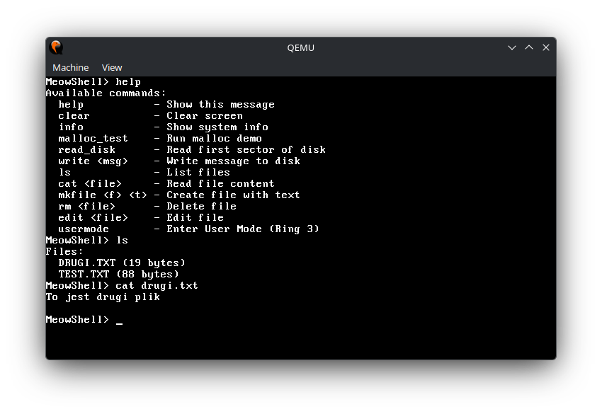

# MeowOS

A modular x86_64 operating system implemented in C and assembly, featuring user mode, syscalls, and a kernel monitor.

## Features

- **Bootloader**: Multiboot-compliant x86_64 bootloader.
- **Memory Management**:
  - Physical Memory Manager (PMM) with bitmap allocation.
  - Virtual Memory Manager (VMM) with recursive 4-level paging.
  - Linked-list heap allocator.
- **Interrupts and I/O**:
  - IDT setup with PIC remapping.
  - Keyboard driver with circular buffer.
  - ATA PIO driver for disk I/O (read/write).
- **Filesystem**: FAT16 support (read/write/delete).
- **Usermode**: Basic user/kernel mode switching with syscalls.
- **Kernel Monitor (KMonitor)**: Command-line interface with commands: help, clear, info, malloc_test, read_disk, write, ls, cat, mkfile, rm, edit.
- **Text Editor**: Simple TUI editor for file editing (not fully featured).

Roadmap and development progress can be found in [docs/ROADMAP.md](docs/ROADMAP.md).

## Architecture

- **Kernel**: Written in C, compiled with GCC for freestanding environment.
- **Assembly**: Boot code and low-level initialization in NASM.
- **Target**: x86_64 architecture, runs in QEMU with a raw disk image.
- **Build System**: Makefile-based compilation and ISO generation with GRUB.

## Build Instructions

1. Ensure dependencies: GCC, NASM, LD, GRUB2, QEMU.
2. Run `make` to build the kernel ISO.
3. The ISO is generated at `dist/meowos.iso`.

## Usage

- Boot the OS in QEMU: `make run` or `qemu-system-x86_64 -cdrom dist/meowos.iso -drive file=disk.img,format=raw,index=0,media=disk`
- Interact via the kernel monitor prompt `KMonitor>`.
- Format the disk image as FAT16 if needed.

## File Structure

- `kernel/`: Kernel source code.
  - `arch/x86_64/`: Architecture-specific assembly code.
  - `core/`: Core kernel components (main, IDT, GDT, syscall).
  - `drivers/`: Hardware drivers (print, keyboard, ATA, PIC, IO).
  - `memory/`: Memory management (PMM, VMM, heap).
  - `fs/`: Filesystem implementations (FAT).
  - `kmonitor/`: Kernel monitor and editor.
  - `include/`: Header files mirroring the source structure.
- `targets/x86_64/`: Linker script and ISO structure.
- `build/`: Object files.
- `dist/`: Binaries and ISO.

## Dependencies

- GCC (freestanding)
- NASM
- GNU LD
- GRUB2
- QEMU

## License

MIT License.