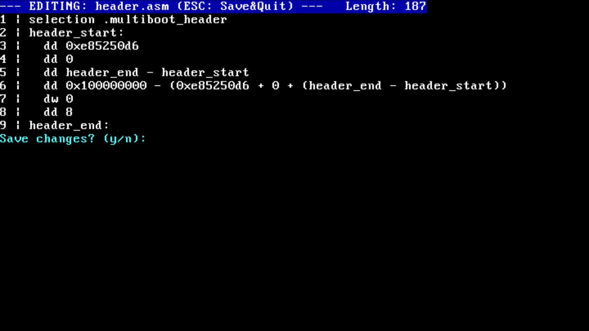
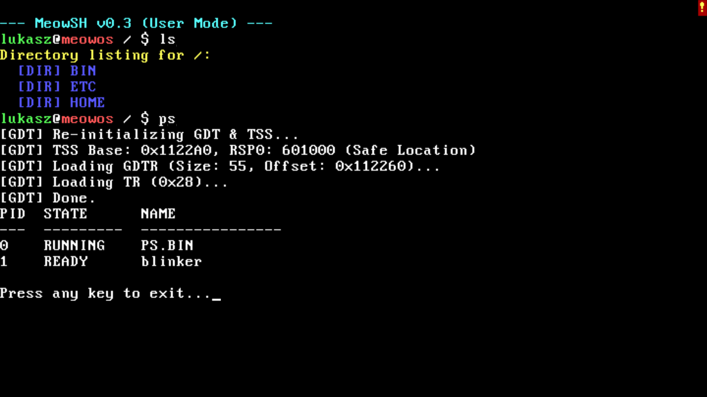
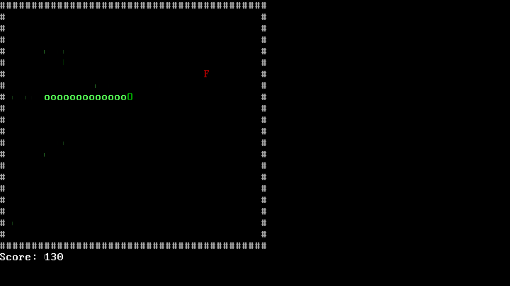

# MeowOS


**MeowOS** is a modular, 64-bit operating system kernel built from scratch. It features a custom memory manager, a virtual file system, preemptive multitasking, user mode isolation, and a Unix-like user environment.

|  |  |
|-------------------------------------|------------------------------------------|
| MeowOS Kernel Monitor (KMonitor)    | MeowOS Built-in Text Editor              |

|  |  |
|-------------------------------------|-------------------------------------|
| MeowOS User Mode Shell (MeowSH)     | MeowOS Snake Game (Multitasking Demo)|

## Legacy Architecture Note

**MeowOS is an educational project designed to understand the low-level fundamentals of operating systems.**

To maintain simplicity and focus on core concepts, this OS targets the **Legacy IBM PC** architecture standards. While it runs perfectly in emulators (QEMU, Bochs) and older hardware, it lacks support for modern PC standards.

* **Booting:** Relies on **BIOS/Multiboot2** (does not support UEFI).
* **Input:** Uses **PS/2 Controller** drivers for keyboard (does not support USB HID stack).
* **Storage:** Uses **ATA PIO** mode for disk access (does not support AHCI, NVMe, or DMA).
* **Graphics:** Relies on **VGA Text Mode** (`0xB8000`) (does not support GOP/Linear Framebuffer).
* **Processing:** Runs on a **Single Core** (does not support SMP/Multicore).

This design choice allows for a codebase that is readable and devoid of the immense complexity required by modern hardware abstraction layers.

## Features

- **Bootloader**: Multiboot2-compliant x86_64 bootloader.
- **Memory Management**:
  - Physical Memory Manager (PMM) with bitmap allocation.
  - Virtual Memory Manager (VMM) with recursive 4-level paging.
  - Kernel Heap Allocator (Linked-list implementation).
- **Multitasking**:
  - Preemptive Round-Robin Scheduler.
  - Support for Kernel Threads and User Processes.
  - Simultaneous execution of shell and background tasks.
- **Interrupts and I/O**:
  - IDT setup with PIC (Programmable Interrupt Controller) remapping.
  - PS/2 Keyboard driver with circular buffer and Shift key support.
  - ATA PIO driver for raw disk I/O.
- **Filesystem**:
  - **FAT16** implementation from scratch.
  - **VFS (Virtual File System)** abstraction layer.
  - Unix-like hierarchy: `/bin`, `/etc`, `/home`.
  - Supports: `read`, `write`, `create`, `delete`, `mkdir`.
- **Userland Environment**:
  - **Ring 3 Isolation:** Secure context switching (`iretq`/`syscall`).
  - **MeowLib:** Standard C library implementation (`stdio`, `string`, `stdlib`).
  - **Session Manager:** Login screen with password protection (`/etc/passwd`).
  - **MeowSH:** User mode shell with path resolution (`$PATH`).
  - **System Tools:** `ps` (process list), `free` (memory usage).
  - **Power Management:** `reboot`, `shutdown`, `logout` commands.
- **Kernel Monitor (KMonitor)**:
  - Fallback interactive shell running in Ring 0 (Debug mode).
- **Apps**:
  - **Text Editor:** Integrated TUI editor.
  - **Snake:** Real-time terminal game.

Roadmap and development progress can be found in [docs/ROADMAP.md](docs/ROADMAP.md).

## Architecture

- **Kernel**: Written in C, compiled with GCC for a freestanding environment.
- **Assembly**: Low-level CPU initialization and context switching in NASM.
- **Target**: x86_64 architecture.
- **Build System**: Recursive Makefile supporting modular directory structure.

Memory layout details are documented in [docs/MEMORY_MAP.md](docs/MEMORY_MAP.md).

## File Structure

- `kernel/`: Kernel source code.
  - `arch/x86_64/`: Architecture-specific assembly (GDT, IDT, Boot).
  - `core/`: Core kernel logic (Main, Syscalls, Scheduler).
  - `drivers/`: Hardware drivers (VGA, Keyboard, ATA, PIC).
  - `memory/`: Memory management (PMM, VMM, Heap).
  - `fs/`: Filesystem implementations (FAT16, VFS).
  - `kmonitor/`: Kernel monitor (Debug Shell).
  - `include/`: Header files mirroring the source structure.
- `userland/`: User space libraries and applications.
  - `lib/`: MeowLib (syscalls, stdio, string, time).
  - `apps/`: User applications.
    - `shell.c`: MeowSH.
    - `login.c`: Session manager.
    - `ps.c`, `free.c`: System utilities.
    - `snake.c`: Game demo.
- `targets/x86_64/`: Linker script and ISO structure.
- `build/`: Intermediate object files.
- `dist/`: Final binaries and ISO image.

## Build Instructions

### Dependencies
Ensure you have the following installed:
* GCC (x86_64-elf cross-compiler recommended)
* NASM
* GNU LD
* GRUB (`grub-mkrescue`)
* QEMU (for emulation)
* `xorriso`
* `mtools` (for FAT formatting)

### Building and Running
1.  **Clone the repo:**
    ```bash
    git clone [https://github.com/lukasz-strama/meow-os.git](https://github.com/lukasz-strama/meow-os.git)
    cd meow-os
    ```

2.  **Create a Disk Image (Required for FAT16):**
    ```bash
    # Create a 32MB raw disk image
    dd if=/dev/zero of=disk.img bs=1M count=32
    # Format it as FAT16
    mkfs.fat -F 16 disk.img
    ```
    *This step can be skipped if building version >= 0.3, as the Makefile automates this.*

3.  **Compile and Run:**
    ```bash
    make run
    ```
    *This command compiles the kernel and userland, builds the ISO, attaches `disk.img`, populates it with `/bin` and `/etc`, and launches QEMU.*

## License

This project is licensed under the **MIT License**.